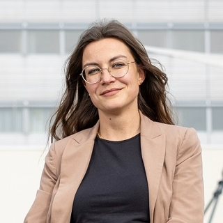
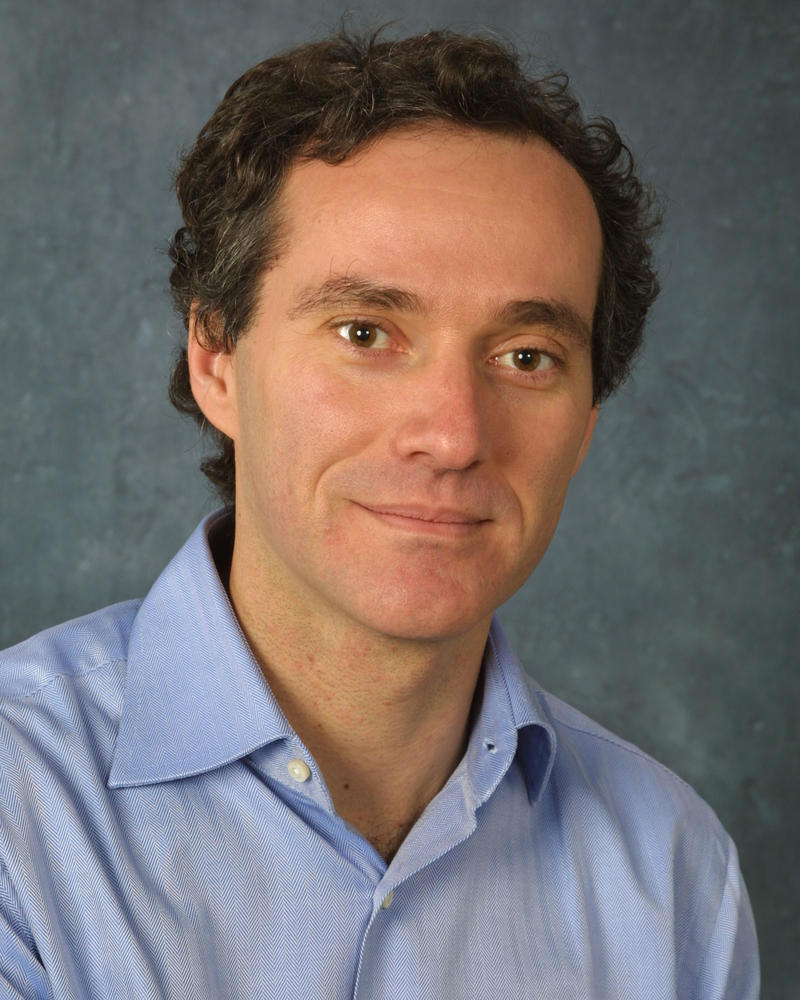
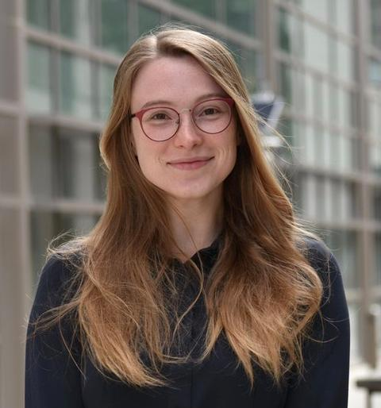

  
  

## About the Workshop
Robot control has matured into a rich and diverse discipline, yet its intellectual coherence is increasingly strained by fragmentation across paradigms, application domains, and publication venues. Classical problems stability under interaction, modeling uncertainty, underactuation, hybrid dynamics, etc. are often treated as "solved" by practitioners, yet they persistently reappear in modern robotic systems operating in contact-rich, uncertain, and learning-enabled environments. 

At the same time, new challenges and opportunities are emerging, ranging from unconventional robotic platforms (e.g., soft and biohybrid robots) to the growing role of machine learning and large-scale physical data. This workshop provides a focused forum to reassess which problems in robot control remain fundamentally open, how their formulation has evolved with advances in hardware, autonomy, and learning, and which challenges genuinely require new control-theoretic perspectives rather than incremental refinements. The emphasis is on conceptual clarity, modeling assumptions, and the limits of existing methods, rather than polished experimental performance.

## Objectives
The objectives are threefold:
* To collectively articulate the most pressing open challenges for control in robotics, across systems, paradigms, and application domains.
* To clarify how recent technological and conceptual advances reshape both long-standing and emerging control problems.
* To strengthen intellectual cohesion across the control and robotics communities by fostering dialogue grounded in shared concepts and explicit problem formulation.

## Target Audience
The workshop targets researchers in control and robotics whose work engages with the modeling, analysis, and control of complex robotic systems, particularly in settings involving physical interaction, uncertainty, hybrid behavior, and learning-enabled components. It is especially relevant for those interested in the foundations of robotics control, the limits of existing frameworks, and the formulation of new problems arising from emerging robotic platforms and technologies.

## Invited Speakers

### Early to Mid Career

  

    
    

      <h3>Laura Ferranti</h3>
      <h4>Delft University of Technology, Netherlands</h4>
    

  

  

    
    

      <h3>Chiara Gabellieri</h3>
      <h4>University of Twente, Netherlands</h4>
    

  

  

    
    

      <h3>Manuel Keppler</h3>
      <h4>German Aerospace Center (DLR), Germany</h4>
    

  

  

    
    

      <h3>Kyoungchul Kong</h3>
      <h4>KAIST, South Korea</h4>
    

  

### Senior

  

    
    

      <h3>Alessandro Astolfi</h3>
      <h4>Imperial College London, UK</h4>
    

  

  

    
    

      <h3>Maria Pia Fanti</h3>
      <h4>Politecnico di Bari, Italy</h4>
    

  

  

    
    

      <h3>Melanie Zeilinger</h3>
      <h4>ETH, Switzerland</h4>
    

  

  

    
    

      <h3>Naira Hovakimyan</h3>
      <h4>UIUC, USA</h4>
    

  

## Tentative Program
Format: Full-day workshop 

* **09:00-09:15:** Opening and workshop framing (Organizers) 
* **09:15-10:55:** Session I - Invited perspective talks by Melanie Zeilinger, Laura Ferranti, and Chiara Gabellieri 
* **10:55-11:25:** Coffee break 
* **11:25-13:05:** Session II - Invited perspective talks by Alessandro Astolfi, Manuel Keppler, and Kyoungchul Kong 
* **13:05-14:15:** Lunch break 
* **14:15-15:55:** Session III - Invited perspective talks by Naira Hovakimyan and Maria Pia Fanti 
* **15:55-16:25:** Coffee break 
* **16:25-17:45:** Session IV - Panel with all speakers, focused on synthesizing open challenges, questioning implicit assumptions, and identifying shared research directions for robot control 
* **17:45-18:00:** Closing remarks 

## Organizers

  

    
    

      <h3>Cosimo Della Santina</h3>
      <h4>TU Delft, NL - Primary Contact</h4>
      
Associate Professor in Robotics and Control. Research on nonlinear control, soft and underactuated robots, and physical interaction. Email: c.dellasantina@tudelft.nl

    

  

  

    
    

      <h3>Kaoru Yamamoto</h3>
      <h4>Kyushu University, JP</h4>
      
Professor of Control and Robotics. Research on control of interconnected dynamical systems, distributed control, multi-agent systems, mechanical networks, and passivity-based control.

    

  

  

    
    

      <h3>Manuel Keppler</h3>
      <h4>German Aerospace Center - DLR, DE</h4>
      
Senior researcher in articulated soft and humanoid robot control, with strong links between theory and large-scale experimental platforms.

    

  

  

    
    

      <h3>Sylvia Herbert</h3>
      <h4>University of California San Diego, US</h4>
      
Assistant Professor working on scalable safety assurances and control policies based on available models and data about the system and environment.

    

  

## Future Outcomes
The organizers aim for the outcomes of this workshop to feed into a joint community effort, such as a position or perspective paper outlining a coherent set of open challenges in robot control. This document would serve as a reference point for future research and discussion within the control and robotics communities.